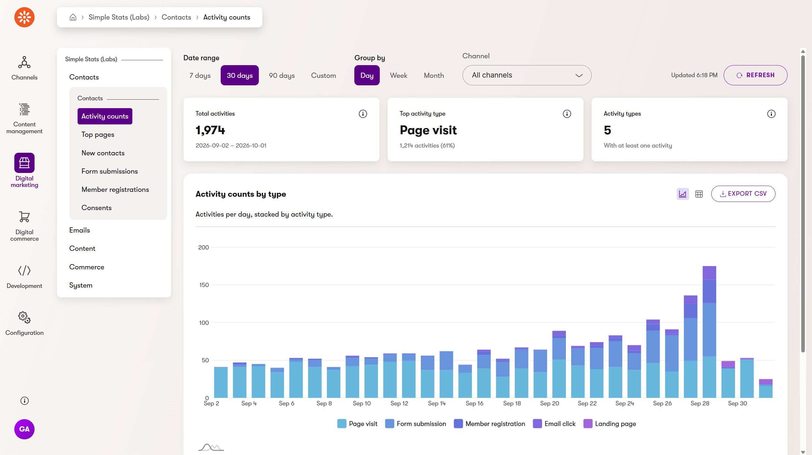
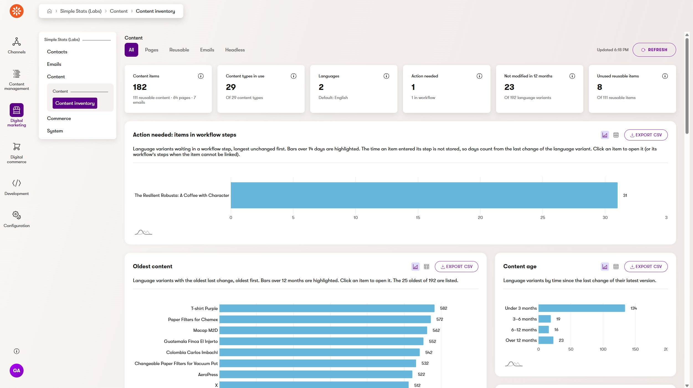
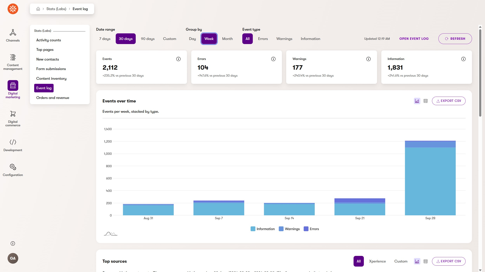
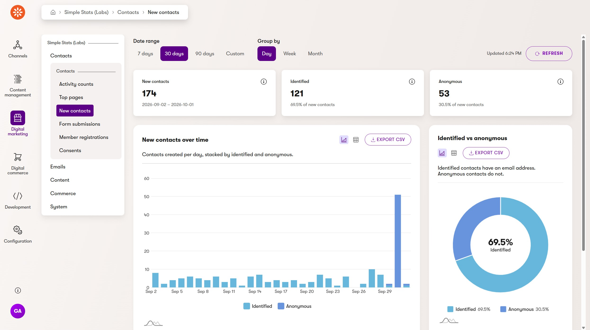
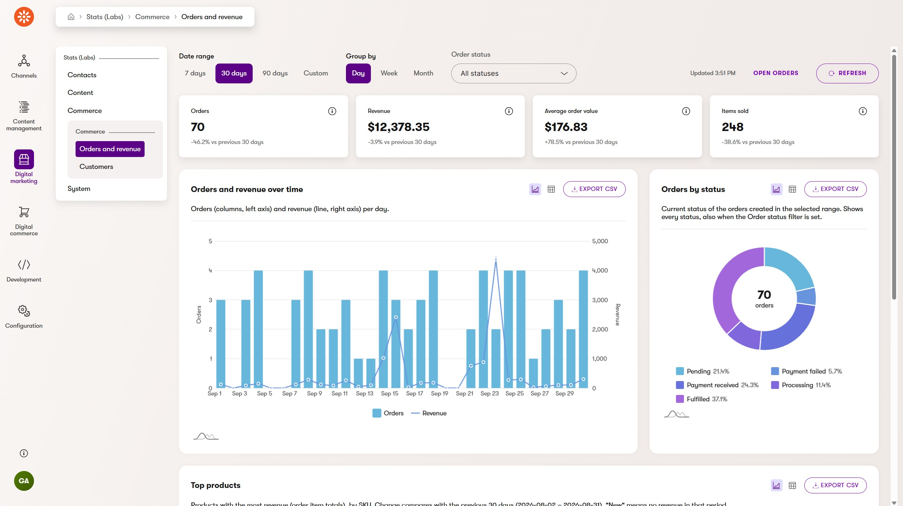

# Xperience by Kentico Labs: Admin Stats

[](https://github.com/Kentico/.github/blob/main/SUPPORT.md#labs-limited-support) [](https://github.com/Kentico/xperience-by-kentico-admin-stats/actions/workflows/ci.yml)

## Description

This project is a Kentico Labs example that shows basic charts about your Xperience by Kentico data in the administration.

### Screenshots







## Requirements

### Library Version Matrix

| Xperience Version | Library Version |
| ----------------- | --------------- |
| >= 31.9.0         | 1.0.0           |

### Dependencies

- [ASP.NET Core 10.0](https://dotnet.microsoft.com/en-us/download)
- [Xperience by Kentico](https://docs.kentico.com)

## Package Installation

Add the package to your application using the .NET CLI

```powershell
dotnet add package Kentico.Xperience.AdminStats
```

## Full Instructions

View the [Usage Guide](./docs/Usage-Guide.md) for more detailed instructions.

## Contributing

To see the guidelines for Contributing to Kentico open source software, please see [Kentico's `CONTRIBUTING.md`](https://github.com/Kentico/.github/blob/main/CONTRIBUTING.md) for more information and follow the [Kentico's `CODE_OF_CONDUCT`](https://github.com/Kentico/.github/blob/main/CODE_OF_CONDUCT.md).

Instructions and technical details for contributing to **this** project can be found in [Contributing Setup](./docs/Contributing-Setup.md).

## License

Distributed under the MIT License. See [`LICENSE.md`](./LICENSE.md) for more information.

## Support

[](https://github.com/Kentico/.github/blob/main/SUPPORT.md#labs-limited-support)

This project has **Kentico Labs limited support**.

See [`SUPPORT.md`](https://github.com/Kentico/.github/blob/main/SUPPORT.md#labs-limited-support) for more information.

For any security issues see [`SECURITY.md`](https://github.com/Kentico/.github/blob/main/SECURITY.md).
